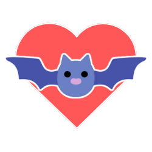

# Unstructured AI: Godot Tutorial

  

A tutorial exploring how to design your own Unstructured AI in Godot Game Engine.

## How to Use

  

1. **Download** [Godot 4.2.X+ standard](https://github.com/godotengine/godot/releases/download/4.2.1-stable/Godot_v4.2.1-stable_linux.x86_64.zip) (not the .NET edition)
2. **Extract** the files of this tutorial into its own folder.
   1. The new folder will contain many files, and most notably a file named `project.godot`.
3. **Run** the Godot executable.
4. In the Project Manager window that appears, **Click** the Import button at the top-left.
5. **Navigate** to the `project.godot` file in the folder you extracted earlier and open it.
6. **Click** Import & Edit.
7. A menu will appear in Godot and let you select and start the tour.

## Screenshots
||
:-------------------------:|:-------------------------:|:-------------------------:

## Support
Your feedback matters! Take a few minutes to share your thoughts on this tutorial through a quick [Feedback Form](https://forms.gle/hyDPJDu6Qcnxubc59). Your insights guide the improvements and make these tutorials even better.

  

